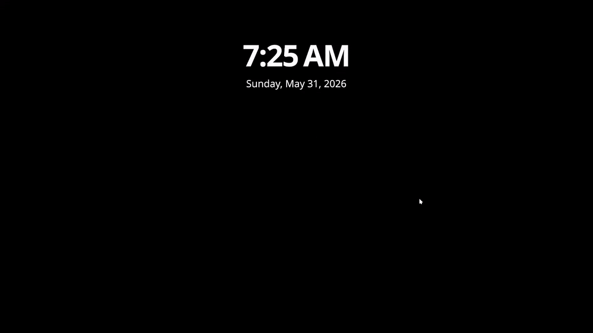

# ScreenWarn

**A privacy-first KDE Plasma intrusion detection tool that alerts you instantly when someone fails to unlock your locked desktop.**

[](LICENSE)
[](https://www.shellscript.sh/)
[](https://kde.org/plasma-desktop/)

---

ScreenWarn captures a video/GIF with the webcam, sends push notifications (NTFY) and emails, and logs everything locally. Designed for the security-conscious Linux user.

---

## Table of Contents

- [Features](#features)
- [Installation](#installation)
- [Configuration](#configuration)
- [Uninstall](#uninstall)
- [Screenshots](#screenshots)
- [Privacy](#privacy)
- [Limitations](#limitations)
- [License](#license)


## Features

- Detection of failed KDE lockscreen attempts
- Webcam footage capture of intruder (GIF preview / MP4 video)
- Instant push alert notification using [NTFY](https://docs.ntfy.sh/)
- Email notification with GIF preview of intruder, video attachment optional
- Local evidence archival
- Runs entirely in user space


## Installation

Quick Start:

Clone the repository, run the install script, and edit your configuration preferences via the ```screenwarn.env``` file.

```bash
git clone https://github.com/jwest31337/screenwarn.git
cd screenwarn

./install.sh

nano ~/.config/screenwarn.env
```

After updating the default configuration, restart the user systemd service to commit changes:

```bash
systemctl --user restart screenwarn.service
systemctl --user status screenwarn.service
```


## Configuration

Notable configuration options:

CAPTURE_SECONDS
*The number of seconds worth of video to be captured upon a login attempt failing. Setting this too high may result in your SMTP server rejecting messages with huge attachment sizes.*

COOLDOWN_SECONDS
*The number of seconds before another attempt is blast-notified. Use this to avoid receiving an avalanche of alerts for multiple failed attempts. By default, KDE should penalty-lock the account after a few bad attempts; Adjusting this may be unnecessary.*

STEALTH_DELAY
*People sometimes look at the keyboard while entering credentials, and then look up at the screen. This small delay allows for a better face capture after a failed login attempt.*


## Uninstall

```./uninstall.sh``` will stop/remove the systemd service, and remove the program from ```$HOME/.local/bin``` .

Any locally collected evidence (video, logs, etc.) can be manually removed.


## Screenshots

Failed unlock example from the KDE lock screen:




## Privacy

ScreenWarn is designed as a local-first security utility, and only collects the data (evidence) you want.

The default configuration has no capability to transmit any data from the machine.

- No external telemetry
- No analytics
- 3rd party services *optional*, you can either use NTFY or self-host, which is recommended
- No credential collection
- No audio recording
- No data leaves the system except through user-configured notification methods (NTFY and/or email)
- All evidence is archived locally under the user's home directory
- Runs entirely in user space
- Does not require root privileges to install or operate


## Limitations

This utility is designed for KDE lockscreen support only. It requires a V4L2-compatible webcam, which is *most* types of common integrated/USB cameras on Linux.

- Webcam indicator LED behavior depends on hardware and firmware of the camera. (LED will likely blink when video is captured)
- Email notifications require working SMTP credentials. See /docs for detailed info.
- Wi-Fi metadata collection (experimental feature) requires NetworkManager (```nmcli```)
- Written and tested on Arch Linux / CachyOS
